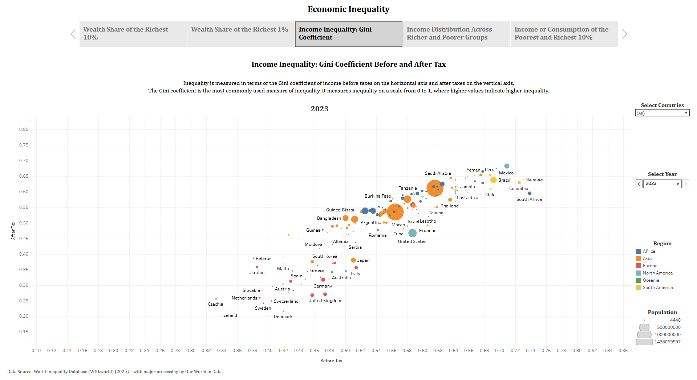
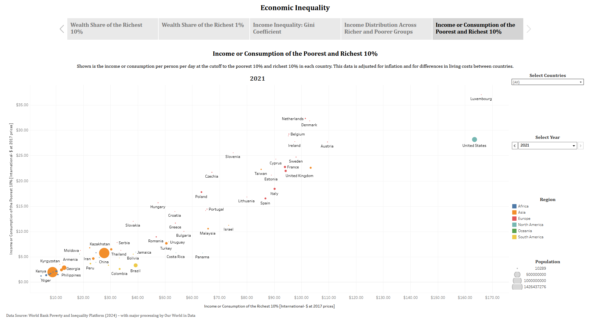
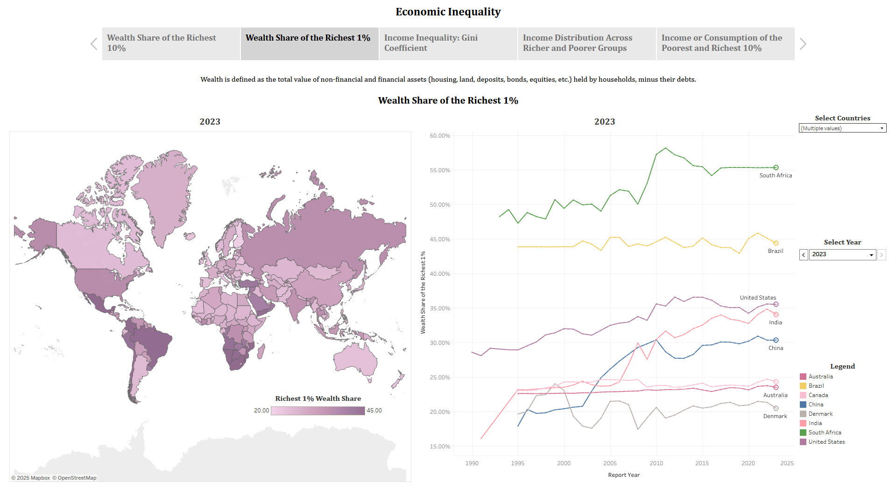
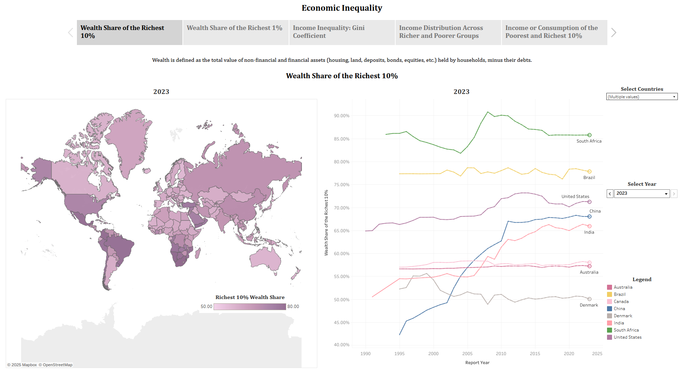
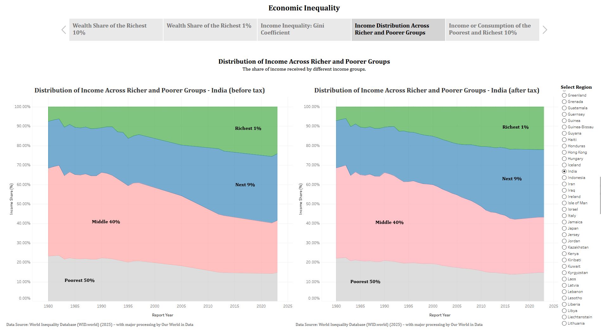

# Economic Inequality | Tableau Dashboard

This Tableau dashboard analyzes global economic inequality through metrics like wealth concentration, income distribution, and Gini coefficients. It compares disparities between the richest and poorest populations across countries and time periods.

**🔗 Interactive Dashboard:**  
[View on Tableau Public](https://public.tableau.com/app/profile/yugandhara.yeolekar/viz/EconomicInequality/EconomicInequality)

## 📂 Data Sources

All datasets were processed by *Our World in Data*:  

1. **Wealth share of the richest 10%**  
   World Inequality Database (WID.world) (2025) – Processed by Our World in Data  
   [Dataset link](https://ourworldindata.org/grapher/wealth-share-richest-10-percent)

2. **Wealth share of the richest 1%**  
   World Inequality Database (WID.world) (2025) – Processed by Our World in Data  
   [Dataset link](https://ourworldindata.org/grapher/wealth-share-richest-1-percent)

3. **Income inequality: Gini coefficient before and after tax**  
   World Inequality Database (WID.world) (2025) – Processed by Our World in Data  
   [Dataset link](https://ourworldindata.org/grapher/income-share-distribution-after-tax-wid)

4. **Distribution of income across richer and poorer groups (before tax)**  
   World Inequality Database (WID.world) (2025) – Processed by Our World in Data  
   [Dataset link](https://ourworldindata.org/grapher/income-share-distribution-before-tax-wid)

5. **Distribution of income across richer and poorer groups (after tax)**  
   World Inequality Database (WID.world) (2025) – Processed by Our World in Data  
   [Dataset link](https://ourworldindata.org/grapher/income-share-distribution-after-tax-wid)

6. **Income or consumption of the poorest and richest 10%**  
   World Bank Poverty and Inequality Platform (2024) – Processed by Our World in Data  
   [Dataset link](https://ourworldindata.org/grapher/daily-income-of-the-poorest-and-richest-decile)

## 📈 Key Visualizations

### 1. Income Inequality - Gini Coefficient  
  
*Income inequality before and after tax (0 = perfect equality, 1 = maximal inequality).*

### 2. Income/Consumption of Poorest vs. Richest 10%  
  
*Daily income/consumption comparison between top and bottom 10%.*

### 3. Wealth Share of the Richest 1%  
  
*Percentage of total wealth held by the top 1% over time.*

### 4. Wealth Share of the Richest 10%  
  
*Global wealth concentration trends among the top 10%.*

### 5. Income Distribution Across Groups  
  
*Income shares by population segments (bottom 50%, middle 40%, top 10%).*

## 🔗 Related Projects

This Tableau dashboard is based on an in-depth SQL analysis of the same dataset. You can explore the SQL project here:
[Economic Inequality SQL Project](https://github.com/Yugandhara-Yeolekar/Economic-Inequality-SQL)
